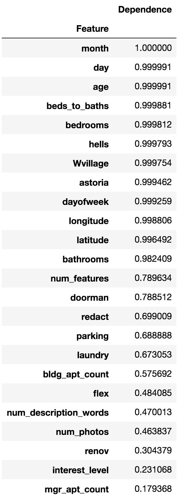

# Feature importances for scikit random forests

By <a href="http://explained.ai/">Terence Parr</a> and <a href="https://www.linkedin.com/in/kerem-turgutlu-12906b65/">Kerem Turgutlu</a>. See [Explained.ai](http://explained.ai) for more stuff.

The scikit-learn Random Forest feature importances strategy is <i>mean decrease in impurity</i> (or <i>gini importance</i>) mechanism, which is unreliable.
To get reliable results, use permutation importance, provided in the `rfpimp` package in the `src` dir. Install with:

`pip install rfpimp`

## Description

See <a href="http://explained.ai/rf-importance/index.html">Beware Default Random Forest Importances</a> for a deeper discussion of the issues surrounding feature importances in random forests (authored by <a href="http://parrt.cs.usfca.edu">Terence Parr</a>, <a href="https://www.linkedin.com/in/kerem-turgutlu-12906b65/">Kerem Turgutlu</a>, <a href="https://www.linkedin.com/in/cpcsiszar/">Christopher Csiszar</a>, and <a href="http://www.fast.ai/about/#jeremy">Jeremy Howard</a>).

The mean-decrease-in-impurity importance of a feature is computed by measuring how effective the feature is at reducing uncertainty (classifiers) or variance (regressors) when creating decision trees within random forests.  The problem is that this mechanism, while fast, does not always give an accurate picture of importance. Strobl <i>et al</i> pointed out in <a href="https://link.springer.com/article/10.1186%2F1471-2105-8-25">Bias in random forest variable importance measures: Illustrations, sources and a solution</a> that &ldquo;<i>the variable importance measures of Breiman's original random forest method ... are not reliable in situations where potential predictor variables vary in their scale of measurement or their number of categories</i>.&rdquo; 

A more reliable method is <i>permutation importance</i>, which measures the importance of a feature as follows. Record a baseline accuracy (classifier) or R<sup>2</sup> score (regressor) by passing a  validation set or the out-of-bag (OOB) samples through the random forest.  Permute the column values of a single predictor feature and then pass all test samples back through the random forest and recompute the accuracy or R<sup>2</sup>. The importance of that feature is the difference between the baseline and the drop in overall accuracy or R<sup>2</sup> caused by permuting the column. The permutation mechanism is much more computationally expensive than the mean decrease in impurity mechanism, but the results are more reliable.

## Sample code

Here's some sample Python code that uses the `rfpimp` package contained in the `src` directory.  The data can be found in <a href="https://github.com/parrt/random-forest-importances/blob/master/notebooks/data/rent.csv">rent.csv</a>, which is a subset of the data from Kaggle's <a href="https://www.kaggle.com/c/two-sigma-connect-rental-listing-inquiries">Two Sigma Connect: Rental Listing Inquiries</a> competition.


```python
from rfpimp import *
import pandas as pd
from sklearn.ensemble import RandomForestRegressor
from sklearn.model_selection import train_test_split

df = pd.read_csv("/Users/parrt/github/random-forest-importances/notebooks/data/rent.csv")

#df = df.iloc[0:5000]

#print(df.head(5))

df_train, df_test = train_test_split(df, test_size=0.20)

# Regressor

features = ['bathrooms','bedrooms','longitude','latitude',
            'price']
df_train = df_train[features]
df_test = df_test[features]

rf = RandomForestRegressor(n_estimators=100,
                           min_samples_leaf=1,
                           n_jobs=-1)

X_train, y_train = df_train.drop('price',axis=1), df_train['price']
X_test, y_test = df_test.drop('price',axis=1), df_test['price']
# Add column of random numbers
X_train['random'] = np.random.random(size=len(X_train))
X_test['random'] = np.random.random(size=len(X_test))
rf.fit(X_train, y_train)

imp = importances(rf, X_test, y_test) # permutation
plot_importances(imp)


# Classifier

df_train, df_test = train_test_split(df, test_size=0.20)

features = ['bathrooms','bedrooms','price','longitude','latitude',
            'interest_level']
df_train = df_train[features]
df_test = df_test[features]

X_train, y_train = df_train.drop('interest_level',axis=1), df_train['interest_level']
X_test, y_test = df_test.drop('interest_level',axis=1), df_test['interest_level']
# Add column of random numbers
X_train['random'] = np.random.random(size=len(X_train))
X_test['random'] = np.random.random(size=len(X_test))

rf = RandomForestClassifier(n_estimators=100,
                            min_samples_leaf=5,
                            n_jobs=-1,
                            oob_score=True)
rf.fit(X_train, y_train)

imp = importances(rf, X_test, y_test, n_samples=-1) # permutation
plot_importances(imp)
```
### Feature correlation

See [Feature collinearity heatmap](notebooks/rfpimp-collinear.ipynb)

### Feature dependencies

The features we use in machine learning are rarely completely independent, which makes interpreting feature importance tricky. We could compute correlation coefficients, but that only identifies linear relationships. A way to at least identify if a feature, x, is dependent on other features is to train a model using x as a dependent variable and all other features as independent variables. Because random forests give us an easy out of bag error estimate, the feature dependence functions rely on random forest models. The R^2 prediction error from the model indicates how easy it is to predict feature x using the other features. The higher the score, the more dependent feature x is. Example:

```python
from rfpimp import *
X_train, y_train = df.drop('price',axis=1), df['price']
rf = RandomForestRegressor(n_estimators=50, n_jobs=-1, oob_score=True)
D = oob_dependences(rf, X_train)
```

That gives something like the following:



You can also get a feature dependence matrix that returns a non-symmetric data frame where each row is the importance of each var to the row's var used as a model target. Example:

```python
DM = feature_dependence_matrix(rf, X_train)
```
